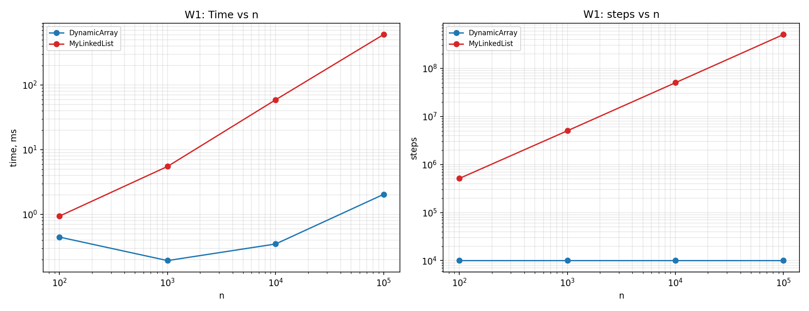
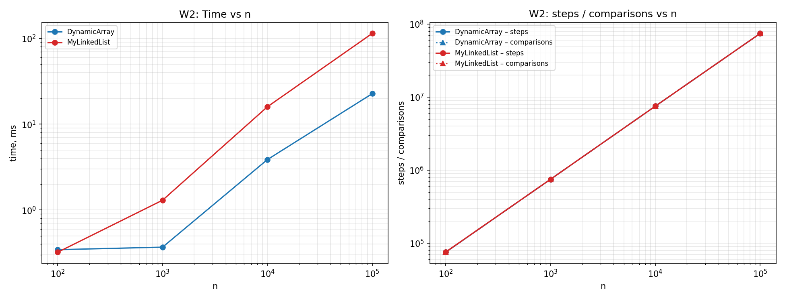
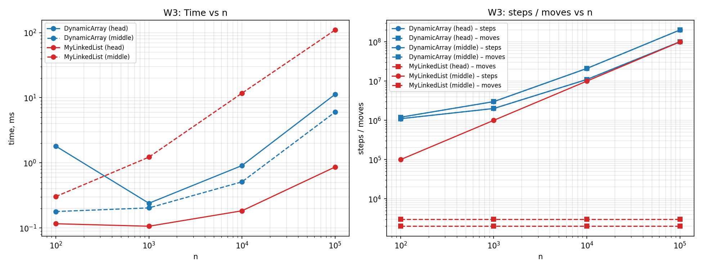
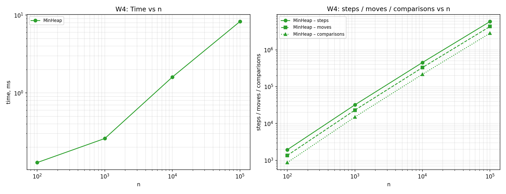

# Data Structures Benchmark Report

## 1. Complexity Table
| Structure | Operation | Best Case | Average Case | Worst Case | Auxiliary Space | Justification |
| :--- | :--- | :--- | :--- | :--- | :--- | :--- |
| **DynamicArray** | `add(x)` | Θ(1) | Θ(1) amortized | Θ(n) | Θ(n) | Worst case occurs when the array is full and requires an O(n) resize. |
| | `add(index, x)` | Θ(1) | Θ(n) | Θ(n) | Θ(n) | Requires shifting elements to the right. Best case is adding at the very end. |
| | `remove(index)` | Θ(1) | Θ(n) | Θ(n) | Θ(n) | Requires shifting elements to the left. Best case is removing the last element. |
| | `get(index)` | Θ(1) | Θ(1) | Θ(1) | Θ(n) | Direct index access via contiguous array memory. |
| | `contains(x)` | Θ(1) | Θ(n) | Θ(n) | Θ(n) | Linear scan. Best case is when the element is at index 0. |
| **MyLinkedList** | `add(x)` | Θ(1) | Θ(1) | Θ(1) | Θ(n) | Appending to the `tail` pointer takes constant time. |
| | `add(index, x)` | Θ(1) | Θ(n) | Θ(n) | Θ(n) | Must traverse nodes from head to the target index. Best case is index 0. |
| | `remove(index)` | Θ(1) | Θ(n) | Θ(n) | Θ(n) | Traversal required to find the node before the removed one. Best case is index 0. |
| | `get(index)` | Θ(1) | Θ(n) | Θ(n) | Θ(n) | Sequential traversal from the head node. |
| | `contains(x)` | Θ(1) | Θ(n) | Θ(n) | Θ(n) | Linear node traversal. |
| **MinHeap** | `insert(x)` | Θ(1) | O(log n) | Θ(log n) | Θ(n) | Bubble-up compares with parents. Best case: new element is the largest. |
| | `peekMin()` | Θ(1) | Θ(1) | Θ(1) | Θ(n) | The minimum is always at the root (index 0). |
| | `extractMin()`| Θ(1) | O(log n) | Θ(log n) | Θ(n) | Swaps root with last element and bubbles down. |

## 2. Loop Invariant Proofs

### Proof 1: `DynamicArray.contains(int x)`
*   **Invariant:** Before the \(i\)-th iteration of the loop, the element `x` is not present in the subarray `data[0 ... i-1]`.
*   **Initialization:** Before the first iteration, \(i = 0\). The subarray `data[0 ... -1]` is strictly empty. An empty array cannot contain `x`, so the invariant trivially holds.
*   **Maintenance:** Assume the invariant holds before iteration \(i\). If the loop body executes, it means `data[i] != x` (otherwise the method returns early). Therefore, `x` is not in `data[0 ... i]`. When \(i\) increments to \(i+1\), the invariant holds for the next iteration.
*   **Termination:** The loop terminates either when it finds `data[i] == x` (returning `true`), or when \(i = size\). If it reaches \(size\), the invariant guarantees that `x` is not in `data[0 ... size-1]`.
*   **Conclusion:** This formally proves that the loop will correctly scan every initialized element without skipping any, returning `true` if and only if the element physically exists in the array.

### Proof 2: `MinHeap.bubbleDown(int index)`
*   **Invariant:** The binary tree satisfies the min-heap property everywhere except possibly between `data[index]` and its children. The subtree contains the exact same elements as before.
*   **Initialization:** Before the loop, `index = 0` (the root). The root was just replaced by the last element of the array. Since the left and right subtrees are valid min-heaps, the only possible violation is exactly at `index = 0`.
*   **Maintenance:** In the loop, we find the smallest child of `index`. If `data[index]` is \(\le\) the smallest child, the violation is resolved. If not, we swap them. After the swap, the heap property is restored between the current node and its children. The only new possible violation moves down to the child's old position, which becomes the new `index`.
*   **Termination:** The loop stops when `index` becomes a leaf node (no children) or when `data[index]` is smaller than its children. In both cases, the single remaining violation disappears.
*   **Conclusion:** The proof guarantees that `bubbleDown` correctly restores the global min-heap structure after `extractMin()` destroys the root.

## 3. Plots
*

## 4. Discussion
When analyzing the benchmark metrics, `DynamicArray` consistently outperforms `MyLinkedList` in real execution time for operations like `get(i)` and sequential iteration, even when the theoretical Big-O complexity is identical. This discrepancy is heavily driven by modern CPU architecture. `DynamicArray` utilizes an `int[]` under the hood, storing primitive values in contiguous memory blocks. When the CPU accesses an index, it loads an entire cache line into the ultra-fast L1/L2 cache. This spatial locality means subsequent array accesses result in instant cache hits.

Conversely, `MyLinkedList` allocates individual `Node` objects scattered across the heap memory. Iterating through the list requires following `next` references, known as pointer chasing. This breaks spatial locality, causing frequent cache misses that force the CPU to fetch data from slower main memory. Furthermore, the linked list incurs significant overhead from object headers for every single node and creates continuous pressure on the Garbage Collector, drastically reducing overall throughput.

`MyLinkedList` is practically better only when elements are frequently added or removed directly at the exact predefined boundaries (like the head). `MinHeap` is the optimal choice for Priority Processing workloads (W4); unlike arrays or lists that require full sorting, a heap maintains dynamic access to the extreme element in strict \(O(\log n)\) time, avoiding unnecessary work.